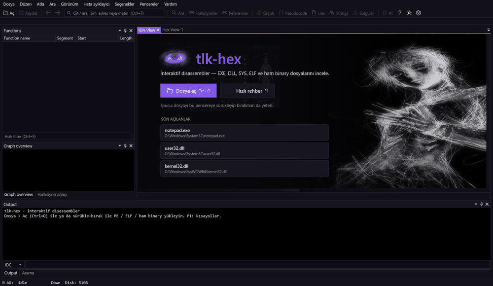
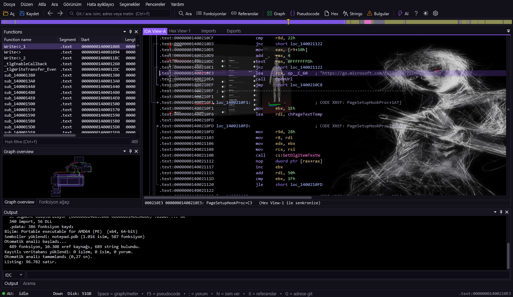
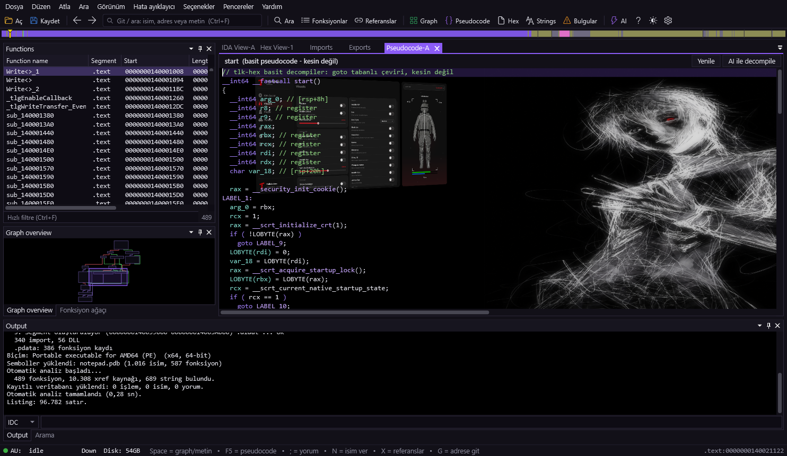
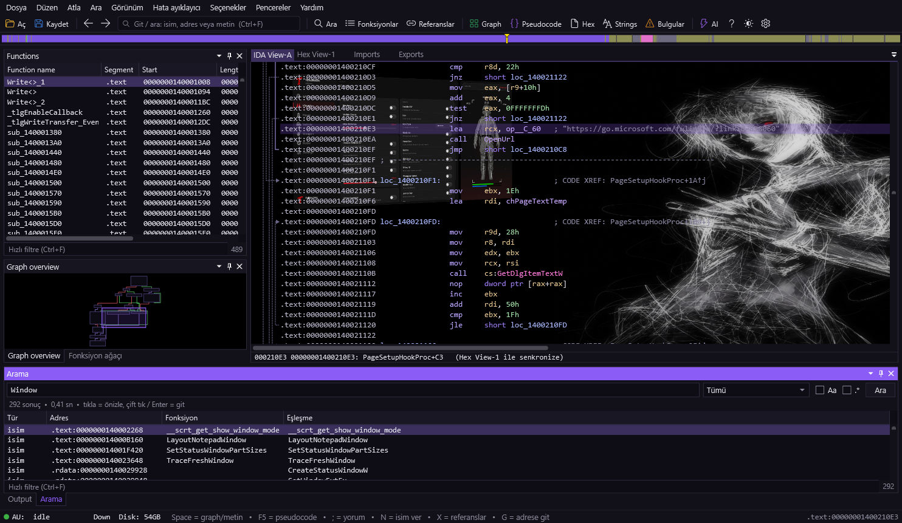
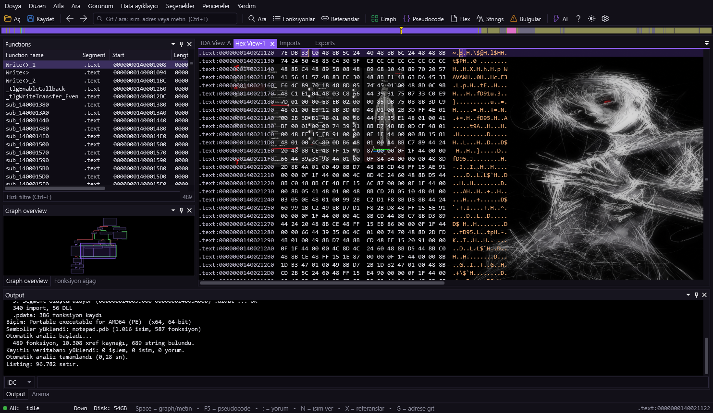

<div align="center">


# tlk-hex

### Interactive disassembler — look inside compiled files.

[](https://github.com/Talkdedsec/tlk-hex/actions/workflows/build.yml)
[](LICENSE)


**[🌐 Website & tutorials](https://talkdedsec.github.io/tlk-hex/)** · [Usage](https://talkdedsec.github.io/tlk-hex/usage.html) · [Learn](https://talkdedsec.github.io/tlk-hex/learn.html) · [Shortcuts](https://talkdedsec.github.io/tlk-hex/shortcuts.html) · [Türkçe](https://talkdedsec.github.io/tlk-hex/tr/)

</div>

---

**tlk-hex** is an IDA-style static analysis / reverse-engineering tool for Windows. It turns EXE, DLL,
SYS, ELF and raw binaries into readable assembly and recovers functions, calls, strings and control
flow — all in one window, in seconds.

> 🔒 It only does **static** analysis. The file you inspect is **never executed**, which makes it
> suitable for examining malicious samples too.

<div align="center">

<br><sub>Welcome · control-flow graph · pseudocode · search · hex · strings</sub>
</div>

## ✨ Features

| | |
|---|---|
| **Auto-analysis** | Its own PE / ELF / binary loader and disassembler engine. Functions, xrefs, switch tables, strings and data types are recovered automatically. |
| **IDA-style text view** | Addresses, cross-references, stack variables, import calls, segments. |
| **Control-flow graph** | Block graph; green/red/blue edges, zoom, bird's-eye map. |
| **Pseudocode** | A C-like, readable form of the assembly (`F5`). |
| **Powerful search** | Names, strings, code lines, comments, byte patterns (`48 8B ?? 05`) and immediates. |
| **Symbol support** | Downloads PDBs so names like `sub_140001A54` become real function names. |
| **API annotations & triage** | Call sites get API prototypes; findings flag packers, imphash and injection/keylog/C2 patterns. |
| **Two-file compare (BinDiff)** | Match functions across two binaries: identical / changed / added / removed, with similarity. |
| **Library signatures (FLIRT-lite)** | Generate byte-pattern signatures from a named build and apply them to a stripped one. |
| **Rule scanning** | Built-in YARA-subset rules (text / hex / regex); load your own `.yar`. Matches flow into findings & report. |
| **HTML report** | Export a shareable, self-contained analysis report (findings, sections, imports, strings). |
| **Hex & patch** | Edit raw bytes, apply patches to a file or export as DIF. The original is untouched. |
| **Name / comment / fold** | Your work is saved and comes back when you reopen the file. |
| **AI help** | Optional — with your own API key: function explanations and pseudocode improvement. |
| **Bilingual UI** | Full English and Turkish interface; switch in Options (applies on restart). |
| **Three themes** | Light · dark · purple night; customizable background image. |

<table>
<tr>
<td width="50%"><br><sub>Text (disassembly) view</sub></td>
<td width="50%"><br><sub>Pseudocode</sub></td>
</tr>
<tr>
<td><br><sub>Search panel</sub></td>
<td><br><sub>Hex view</sub></td>
</tr>
</table>

## 🚀 Getting started

**Requires** Windows 10 / 11 and the [.NET 10 SDK](https://dotnet.microsoft.com/).

```sh
git clone https://github.com/Talkdedsec/tlk-hex.git
cd tlk-hex
dotnet build -c Release
```

Output: `bin\Release\net10.0-windows\tlk-hex.exe` — or just run `run.bat`.

Then drag-and-drop a file; tlk-hex handles the rest. Press `F1` in-app for a quick guide, or see the
**[tutorials](https://talkdedsec.github.io/tlk-hex/learn.html)**.

Prebuilt Windows binaries are on the [Releases](https://github.com/Talkdedsec/tlk-hex/releases) page:

- **`…-win-x64-portable.exe`** — a single, self-contained executable. No .NET install needed; just download and run.
- **`…-win-x64.zip`** — the same portable exe, zipped (friendlier download).
- **`…-win-x64-fx.zip`** — framework-dependent build (much smaller, needs the .NET 10 Desktop Runtime).

> The downloaded `.exe` is not code-signed, so Windows SmartScreen may warn the first time.
> Choose **More info → Run anyway**, or build from source yourself.

Or install with a package manager:

```powershell
scoop install https://raw.githubusercontent.com/Talkdedsec/tlk-hex/main/packaging/scoop/tlk-hex.json
# winget (once accepted into winget-pkgs):
winget install Talkdedsec.tlk-hex
```

## ⌨️ Common shortcuts

| Key | Action | | Key | Action |
|---|---|---|---|---|
| `G` | Go to address / name | | `N` | Rename |
| `Space` | Text ↔ graph | | `;` | Add comment |
| `F5` | Pseudocode | | `X` | Where is this used? |
| `Ctrl`+`Shift`+`F` | Search panel | | `C`/`D`/`A`/`U` | Code / data / string / undefined |
| `Ctrl`+`F` | Go / search box | | `Ctrl`+`W` | Save work |

> Full list: `F1` in-app or the [shortcuts page](https://talkdedsec.github.io/tlk-hex/shortcuts.html).
> One-page [cheat sheet](https://talkdedsec.github.io/tlk-hex/cheatsheet.html) (shortcuts, patch bytes, asm patterns, triage).

## 🏷️ Symbols & AI

- **Symbols:** For Windows files, *File → Download symbols* brings real function names (also asked on
  first open). Only the PDB name and identity go to the server; downloads are cached.
- **AI:** Optional. Enter your own API key in *Options → AI support* to ask about functions and improve
  pseudocode. Everything else works fully without a key.

## 🧩 Built with

- [Iced](https://github.com/icedland/iced) — x86/x64 disassembler (MIT)
- [AvalonDock](https://github.com/Dirkster99/AvalonDock) — docking layout

## ⚖️ Responsible use

tlk-hex is for learning, inspecting your own code, security research, CTFs and **authorized** analysis
only. It is **not** meant for removing the copy protection of software you didn't buy or for infringing
others' rights. Use it on files you're authorized for.

## 🎯 Practice

Learn by doing: **[Practice crackmes](https://github.com/Talkdedsec/tlk-hex/releases/tag/crackmes-v1)** — six
original reverse-engineering exercises (plaintext, XOR, keygen, per-index transform, patching, stack string).
Step-by-step walkthrough in [Module 07](https://talkdedsec.github.io/tlk-hex/learn.html#m7) and [Module 08](https://talkdedsec.github.io/tlk-hex/learn.html#m8).

## 🤝 Contributing

Issues and pull requests are welcome — see [CONTRIBUTING](CONTRIBUTING.md). Security reports: see
[SECURITY](SECURITY.md).

## 📄 License

Source-available under the **MIT License with the [Commons Clause](https://commonsclause.com/)**:
you may use, modify and share it freely, and you **must keep the attribution** (author name and this
repository link) in copies, **but you may not sell it**. © 2026 [Talkdedsec](https://github.com/Talkdedsec/tlk-hex).

> Not OSI "open source" (it restricts selling). The author keeps all rights and may grant commercial
> licenses separately.

<details>
<summary><b>Türkçe</b></summary>

<br>

**tlk-hex**, Windows için IDA tarzı bir statik analiz / tersine mühendislik aracıdır. EXE, DLL, SYS,
ELF ve ham binary dosyalarını okunur assembly'ye çevirir; fonksiyonları, çağrıları, metinleri ve akışı
çıkarır — hepsi tek pencerede, saniyeler içinde. Yalnızca **statik** analiz yapar; incelenen dosya
**hiçbir zaman çalıştırılmaz**.

**Özellikler:** kendi PE/ELF/binary yükleyicisi ve disassembler motoru · IDA tarzı metin görünümü ·
akış grafiği · C benzeri pseudocode (`F5`) · güçlü arama (isim, metin, kod, yorum, bayt dizisi, sabit
değer) · PDB sembol desteği · hex görünümü ve yama · isim/yorum/klasör (kaydedilen veritabanı) ·
isteğe bağlı AI yardımı · açık / koyu / mor temalar.

**Derleme:** Windows 10/11 ve [.NET 10 SDK](https://dotnet.microsoft.com/) gerekir.

```sh
git clone https://github.com/Talkdedsec/tlk-hex.git
cd tlk-hex
dotnet build -c Release
```

Çıktı: `bin\Release\net10.0-windows\tlk-hex.exe`. Uygulamada `F1` ile hızlı rehber, ayrıntı için
**[Türkçe site](https://talkdedsec.github.io/tlk-hex/tr/)**.

**Kullanım sorumluluğu:** öğrenmek, kendi kodunu incelemek, güvenlik araştırması, CTF ve *izinli* analiz
içindir — satın almadığın bir yazılımın korumasını kaldırmak ya da başkasının haklarını ihlal etmek için
değil. Yalnızca yetkili olduğun dosyalarda kullan.

**Lisans:** [MIT](LICENSE) © 2026 Talkdedsec.

</details>
