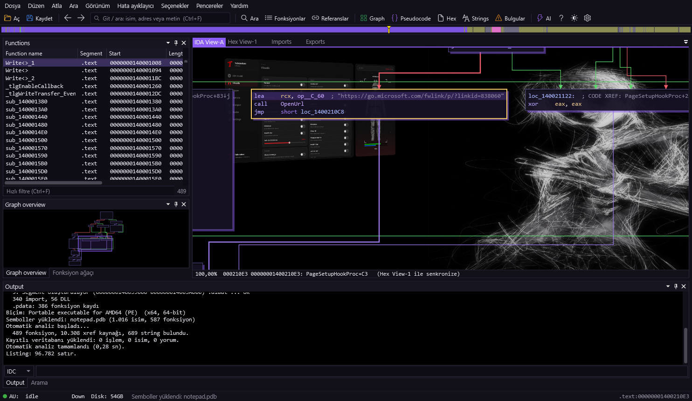

<div align="center">


# tlk-hex

### İnteraktif disassembler — derlenmiş dosyaların içini gör.

[](LICENSE)


**[🌐 Tanıtım & eğitim sitesi](https://talkdedsec.github.io/tlk-hex/)** · [Kullanım](https://talkdedsec.github.io/tlk-hex/kullanim.html) · [Eğitim](https://talkdedsec.github.io/tlk-hex/egitim.html) · [Kısayollar](https://talkdedsec.github.io/tlk-hex/kisayollar.html)

</div>

---

**tlk-hex**, Windows için IDA tarzı bir statik analiz / tersine mühendislik aracıdır.
EXE, DLL, SYS, ELF ve ham binary dosyalarını okunur assembly'ye çevirir; fonksiyonları,
çağrıları, metinleri ve akışı çıkarır — hepsi tek pencerede, saniyeler içinde.

> 🔒 Yalnızca **statik** analiz yapar. İncelenen dosya **hiçbir zaman çalıştırılmaz**,
> bu yüzden zararlı örnekleri incelemek için de uygundur.

<div align="center">

<br><sub>Akış grafiği · semboller yüklü</sub>
</div>

## ✨ Özellikler

| | |
|---|---|
| **Otomatik analiz** | Kendi PE / ELF / binary yükleyicisi ve disassembler motoru. Fonksiyonlar, xref'ler, switch tabloları, string'ler ve veri tipleri kendiliğinden çıkar. |
| **IDA tarzı metin görünümü** | Adresler, çapraz referanslar, yığın değişkenleri, import çağrıları, segmentler. |
| **Akış grafiği** | Blok grafiği; yeşil/kırmızı/mavi dallar, zoom, kuş bakışı harita. |
| **Pseudocode** | Assembly'nin C benzeri okunur hali (`F5`). |
| **Güçlü arama** | İsim, metin, kod satırı, yorum, bayt dizisi (`48 8B ?? 05`) ve sabit değer. |
| **Sembol desteği** | PDB indirip `sub_140001A54` gibi isimleri gerçek fonksiyon adlarına çevirir. |
| **Hex & yama** | Ham baytları düzenle, dosyaya uygula ya da DIF olarak dışa aktar. |
| **İsim / yorum / klasör** | Çalışman kaydedilir, dosyayı tekrar açınca geri gelir. Orijinal dosya bozulmaz. |
| **AI yardımı** | Kendi API anahtarınla fonksiyon açıklaması ve pseudocode iyileştirmesi (isteğe bağlı). |
| **Üç tema** | Açık · koyu · mor gece; özelleştirilebilir arka plan görseli. |

<table>
<tr>
<td width="50%"><br><sub align="center">Metin (disassembly) görünümü</sub></td>
<td width="50%"><br><sub>Pseudocode</sub></td>
</tr>
<tr>
<td><br><sub>Arama paneli</sub></td>
<td><br><sub>Hex görünümü</sub></td>
</tr>
</table>

## 🚀 Başlangıç

**Gereksinim:** Windows 10 / 11 ve [.NET 10 SDK](https://dotnet.microsoft.com/).

```sh
git clone https://github.com/Talkdedsec/tlk-hex.git
cd tlk-hex
dotnet build -c Release
```

Çıktı: `bin\Release\net10.0-windows\tlk-hex.exe` — ya da doğrudan `run.bat`.

Sonra bir dosya sürükle-bırak, gerisini tlk-hex halleder. İlk adımlar için uygulamada `F1`,
ayrıntı için **[eğitim sitesine](https://talkdedsec.github.io/tlk-hex/egitim.html)** bak.

## ⌨️ Sık kullanılan kısayollar

| Tuş | İş | | Tuş | İş |
|---|---|---|---|---|
| `G` | Adrese / isme atla | | `N` | Yeniden adlandır |
| `Space` | Metin ↔ graph | | `;` | Yorum ekle |
| `F5` | Pseudocode | | `X` | Nereden kullanılıyor? |
| `Ctrl`+`Shift`+`F` | Arama paneli | | `C`/`D`/`A`/`U` | Kod / veri / string / tanımsız |
| `Ctrl`+`F` | Git / ara kutusu | | `Ctrl`+`W` | Çalışmayı kaydet |

> Tam liste: uygulamada `F1` veya [kısayollar sayfası](https://talkdedsec.github.io/tlk-hex/kisayollar.html).

## 🏷️ Semboller & AI

- **Semboller:** Windows dosyalarında *Dosya → Sembolleri indir* ile gerçek fonksiyon adları gelir
  (ilk açılışta da sorulur). Sunucuya yalnızca PDB adı ve kimliği gider; indirilenler önbelleğe alınır.
- **AI:** İsteğe bağlı. *Seçenekler → AI desteği*'ne kendi API anahtarını girersen fonksiyonlar hakkında
  soru sorabilir, pseudocode'u iyileştirebilirsin. Anahtar olmadan diğer her şey tam çalışır.

## 🧩 Kullanılan kütüphaneler

- [Iced](https://github.com/icedland/iced) — x86/x64 disassembler (MIT)
- [AvalonDock](https://github.com/Dirkster99/AvalonDock) — pencere yerleşimi

## ⚖️ Kullanım sorumluluğu

tlk-hex; öğrenmek, kendi yazdığın kodu incelemek, güvenlik araştırması, CTF ve **izinli** analiz içindir.
Satın almadığın bir yazılımın lisans/kopya korumasını kaldırmak ya da başkasının haklarını ihlal etmek
bu aracın amacı **değildir**. Yalnızca yetkili olduğun dosyalarda kullan.

## 📄 Lisans

[MIT](LICENSE) © 2026 Talkdedsec

<details>
<summary><b>English</b></summary>

<br>

**tlk-hex** is an IDA-style static analysis / reverse-engineering tool for Windows. It turns EXE, DLL,
SYS, ELF and raw binaries into readable assembly and recovers functions, calls, strings and control
flow — in one window, in seconds. It only does **static** analysis; the file you inspect is **never run**.

**Features:** own PE/ELF/binary loader & disassembler engine · IDA-style text view · control-flow graph ·
C-like pseudocode (`F5`) · powerful search (names, strings, code, comments, byte patterns, immediates) ·
Microsoft symbol (PDB) support · hex view & patching · rename / comment / fold with a saved database ·
optional AI help with your own API key · light / dark / purple themes.

**Build:** needs Windows 10/11 and the [.NET 10 SDK](https://dotnet.microsoft.com/).

```sh
git clone https://github.com/Talkdedsec/tlk-hex.git
cd tlk-hex
dotnet build -c Release
```

Output: `bin\Release\net10.0-windows\tlk-hex.exe`. Press `F1` in-app for a quick guide, or see the
**[live site](https://talkdedsec.github.io/tlk-hex/)**.

**Responsible use:** for learning, inspecting your own code, security research, CTFs and *authorized*
analysis only — not for removing the copy protection of software you didn't buy or infringing others'
rights. Use it on files you're authorized for.

**License:** [MIT](LICENSE) © 2026 Talkdedsec.

</details>
